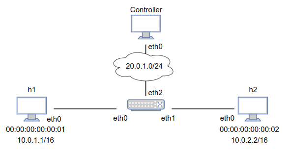

# 05-POX Datapaths

## Introduction

Controller to switch communication: this is performed by controller code which sends an OpenFlow message to a particular
switch.
Switch to controller communication: messages show up in POX as events (for which you can write event handlers).

In POX, controller can communicate with a datapath in two ways:

* via a Connection object for that particular datapath: one connection object for each switch
* via an OpenFlow Nexus which is managing that datapath: one OpenFlow Nexus manages all connections

## Lab

We have created a POX component, called reflector, that:

* it is a listener of packetIn events
* when a relevant event occurs, then the component extract the ethernet frame and swaps source and destination mac
* after that, it sends the frame back in the dataplane through a packet out (see next slide), indicating to forward it
  out from the switch port from which it has been received



### Test the implementation

To run the network scenario, open a terminal in the scenario directory and type:

```bash
kathara lstart 
```

Launch in the root@controller:

```
python3.9 /pox/pox.py Reflector openflow.of_01 -port=6653
```

You will obtain:

```
# general informations
POX 0.7.0 (gar) / Copyright 2011-2020 James McCauley, et al.

# normal Warning, don't worry
WARNING:version:Support for Python 3 is experimental.
INFO:core:POX 0.7.0 (gar) is up.

# connection of the switch
INFO:openflow.of_01:[e6-b1-b4-df-ec-42 1] connected
```

In `h2` terminal, to see that no packet arrives:

```
# launch and leave it on
tcpdump -i eth0 
```

In `h1` terminal:

```
python3 send_receive.py 
```

In the root@controller terminal you will see:

```
Received from (and sent back to): 00:00:00:00:00:01
The destination before was: 11:22:33:44:55:66
Port used: 1
```

You can see that the packet is reflected to `h1` and `h2` does not receive any packets.

To undeploy the network scenario, open a terminal in the network scenario directory and type:

```bash
kathara lclean
```

Inside the controller there are also the `AListener` and  `BListener` components of the [03-pox-events](../03-pox-events)
lab. Try to launch all of them.