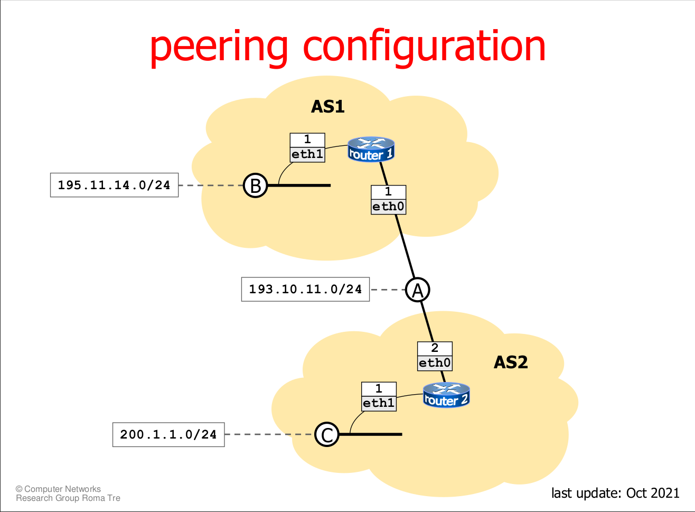

# BGP Announcement

This tutorial shows how to manage the lab filesystem from the Python APIs.

[kathara-lab_bgp-announcement_frr.py](kathara-lab_bgp-announcement_frr.py) contains the code for running the lab.

In the following we will provide a complete explanation of the script. 

## Lab Configuration
We will recreate the official lab [BGP Announcement FRR](../../../Main-Labs/Interdomain-Routing/FRR/BGP-Announcement) 
using the APIs. 



To do so, we need to: 
1. Create the basic topology.
2. Configure router1.
3. Configure router2. 
4. Deploy the lab.
5. Connect to devices.

### 1 - Create the basic topology

```python
from Kathara.manager.Kathara import Kathara
from Kathara.model.Lab import Lab

# Create the network scenario
lab = Lab("BGP Announcement")

# Create router1 with image "kathara/frr"
router1 = lab.new_machine("router1", **{"image": "kathara/frr"})

# Create and connect router1 interfaces
lab.connect_machine_to_link(router1.name, "A")
lab.connect_machine_to_link(router1.name, "B")

# Create router2 with image "kathara/frr"
router2 = lab.new_machine("router2", **{"image": "kathara/frr"})

# Create and connect router1 interfaces
lab.connect_machine_to_link(router1.name, "A")
lab.connect_machine_to_link(router1.name, "C")
```
This snippet creates a lab instance that hosts two devices. Each device uses the `kathara/frr` image and has 
two interfaces. Devices are attached on collision domain `A`.

### 2 - Configure router1

```python
# Configure router1 startup commands
lab.create_file_from_list(
    [
        "/sbin/ifconfig eth0 193.10.11.1 up",
        "/sbin/ifconfig eth1 195.11.14.1 up",
        "/etc/init.d/frr start"
    ],
    "router1.startup"
)

# Configure BGP on router 1
router1.create_file_from_path(os.path.join("assets", "router1-frr.conf"), "/etc/frr/frr.conf")
router1.create_file_from_path(os.path.join("assets", "daemons"), "/etc/frr/daemons")
router1.create_file_from_string(content="service integrated-vtysh-config\n", dst_path="/etc/frr/vtysh.conf")
router1.update_file_from_string(content="hostname router1-frr\n", dst_path="/etc/frr/vtysh.conf")
```
In this snippet we start configuring the startup commands of `router1` using the 
`create_file_from_list(content, dst_path)` method.

This is a method from the [FilesystemMixin](). 
A Mixin is a way of defining code that can be reused in multiple class hierarchies. Both the [Lab]() and [Machine]() classes
implement the FilesystemMixin, giving access to methods for managing the filesystem. 
Here we use a FilesystemMixin method from the Lab instance to create the startup file of `router1` (is the same as 
creating a `router1.startup` file in root directory of a standard lab). 

Then, we use the `create_file_from_path` method from `router1`. This method allows users to load files into devices 
directly from the host filesystem (is the same as put files in the `router1` directory in a standard lab).
In this way, we load the bgp configurations of `router1` taken the files from the `assets` directory and putting them in 
the `/etc/frr/` directory of `router1`.

Finally, for demonstration purposes, we use the `create_file_from_string` method to create the `vtysh` configuration, 
and the `update_file_from_string` to add a line to it.  

### 3 - Configure router2
The configuration of `router2` is analogous to the one of `router1`.

```python
# Configure router2 startup commands
lab.create_file_from_list(
    [
        "/sbin/ifconfig eth0 193.10.11.2 up",
        "/sbin/ifconfig eth1 200.1.1.1 up",
        "/etc/init.d/frr start"
    ],
    "router2.startup"
)
# Configuring BGP on router2
router2.create_file_from_path(os.path.join("assets", "router2-frr.conf"), "/etc/frr/frr.conf")
router2.create_file_from_path(os.path.join("assets", "daemons"), "/etc/frr/daemons")
router2.create_file_from_string(content="service integrated-vtysh-config\n", dst_path="/etc/frr/vtysh.conf")
router2.update_file_from_string(content="hostname router2-frr\n", dst_path="/etc/frr/vtysh.conf")
```

### 4 - Deploy the lab

To deploy the network scenario we need to call the `deploy_lab` method of the Kathara manager.

```python
Kathara.get_instance().deploy_lab(lab)
```

### 5 - Connecting to devices
Now that we wrote the code to deploy the lab. We can write some code to interact with the running devices. 
For testing that everything is working, we log into `router1` to inspect its routing table and its BGP control plane.  

```python
Kathara.get_instance().connect_tty(router1.name, lab_name=lab.name)
```

Calling this method will open a terminal on `router1` to interact with it. 
The control will return to the lab script when after closing the terminal (e.g, `exit`, `CTRL + D`).

Once you are connected to the router you can inspect its routing table and its control plane.
```
root@router1:/# ip r
193.10.11.0/24 dev eth0 proto kernel scope link src 193.10.11.1 
195.11.14.0/24 dev eth1 proto kernel scope link src 195.11.14.1 
root@router1:/# vtysh

Hello, this is FRRouting (version 7.5.1).
Copyright 1996-2005 Kunihiro Ishiguro, et al.

router1-frr# show ip bgp
BGP table version is 2, local router ID is 195.11.14.1, vrf id 0
Default local pref 100, local AS 1
Status codes:  s suppressed, d damped, h history, * valid, > best, = multipath,
               i internal, r RIB-failure, S Stale, R Removed
Nexthop codes: @NNN nexthop's vrf id, < announce-nh-self
Origin codes:  i - IGP, e - EGP, ? - incomplete

   Network          Next Hop            Metric LocPrf Weight Path
*> 195.11.14.0/24   0.0.0.0                  0         32768 i
*> 200.1.1.0/24     193.10.11.2              0             0 2 i

Displayed  2 routes and 2 total paths
router1-frr# 
```

### 6 - Undeploy the lab

```python
Kathara.get_instance().undeploy_lab(lab_name=lab.name)
```
